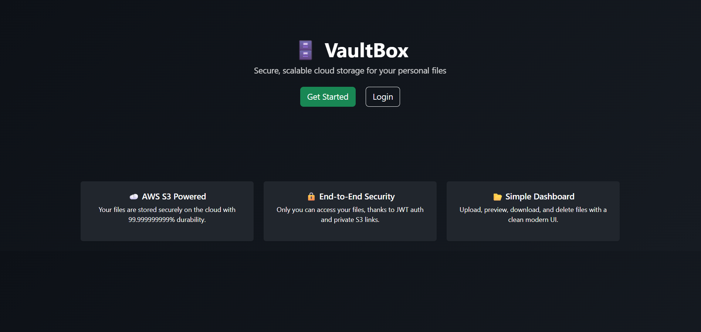
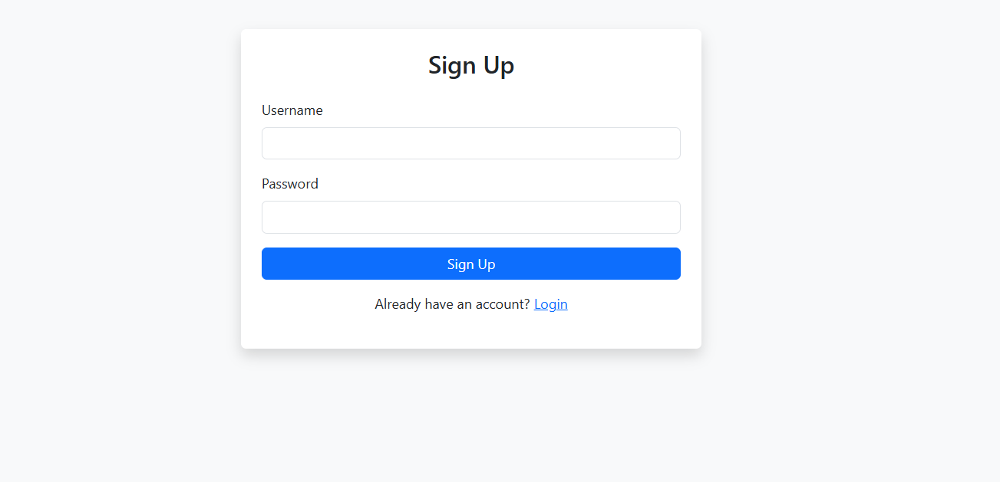
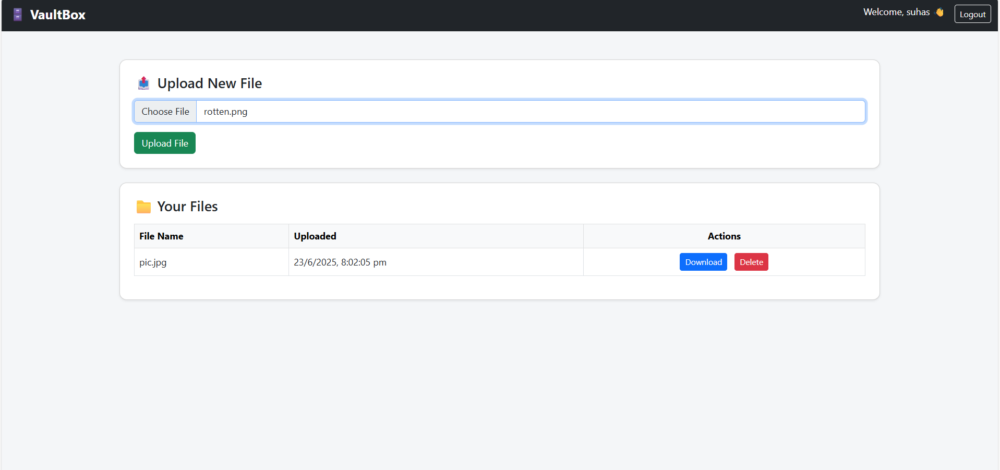

 🗄️ VaultBox – Secure Cloud File Storage

VaultBox is a full-stack secure file storage system built with Node.js, AWS S3, and DynamoDB. It allows users to register, authenticate, and manage personal files on the cloud via a clean web interface. Designed with scalability, security, and simplicity in mind.. 

---

## 🚀 Features

- 🔐 **JWT Authentication** – User login and signup with secure token-based access
- ☁️ **AWS S3 Storage** – All files are uploaded to an S3 bucket with pre-signed URLs
- 🗂️ **File Management** – Upload, list, download, and delete files from your personal vault
- 📄 **Metadata Tracking** – DynamoDB stores per-user file data (filename, upload time, etc.)
- 🌐 **Modern UI** – Clean, responsive HTML + Bootstrap interface with dark navbar
- 🧠 **System Design Ready** – Designed with production cloud architecture in mind

---

## 🧰 Tech Stack

| Layer         | Technology               |
|---------------|---------------------------|
| Backend       | Node.js, Express          |
| Cloud Storage | AWS S3                    |
| Database      | AWS DynamoDB              |
| Auth          | JWT (JSON Web Token)      |
| Frontend      | HTML, CSS, Bootstrap      |
| Tools         | Multer, AWS SDK v3, dotenv|

---

## 📸 Screenshots

### 🏠 Landing Page


### 🔐 Auth Page


### 📁 Dashboard


---

## 🛠️ Getting Started

### 🔧 Prerequisites
- Node.js installed
- AWS Account (with S3 bucket & DynamoDB table set up)
- `.env` file configured with AWS keys & bucket/table names

### 🔍 Environment Variables (`.env`)
```env
PORT=5000
JWT_SECRET=your_secret
S3_BUCKET_NAME=your-bucket-name
AWS_REGION=ap-south-1
AWS_ACCESS_KEY_ID=your-access-key
AWS_SECRET_ACCESS_KEY=your-secret-key


Built with ❤️ by Muddana Aravind Kumar
Cloud-native, backend-focused file management system.


